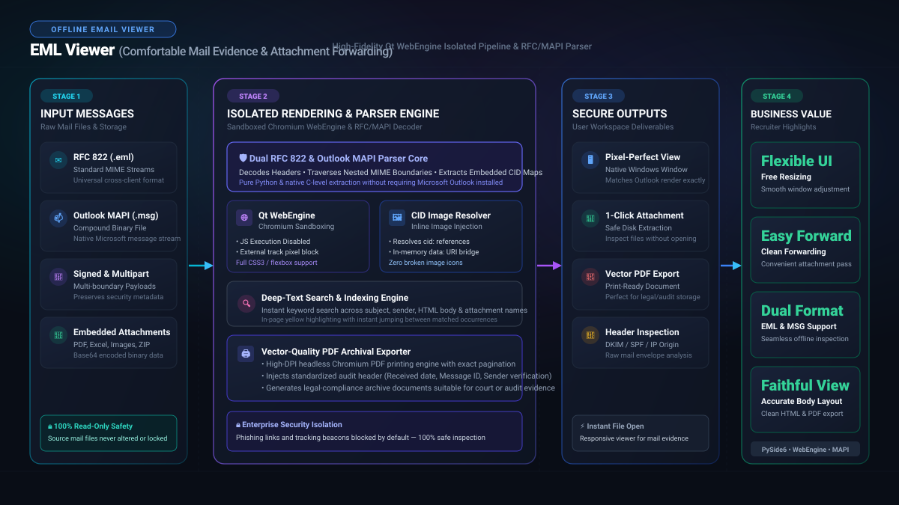

*다른 언어로 읽기: [English](README.md), [한국어](README.ko.md), [Polski](README.pl.md)*

# 🔍 EML Viewer: 실무 증빙 이메일 열람 및 편리한 포워딩 뷰어

<p align="center">
  
</p>

> **증빙 이메일 간편 열람 · 자유로운 창 크기 조절 · 첨부파일 확인 및 간편 포워딩**

**EML Viewer**는 사내 업무 증빙으로 보관된 .eml 및 Outlook .msg 이메일 파일을 독립 실행형 창에서 안전하고 편리하게 열람·검증하고 공유할 수 있도록 지원하는 실무 뷰어입니다.

정산, 세무, 계약 검토 등 실무에서는 과거 이메일 파일을 증빙 자료로 열람하거나 다른 담당자에게 전달해야 하는 경우가 많습니다. 본 도구는 외부 오피스 라이선스 종속 없이 자유로운 창 크기 조절과 분할 뷰를 제공하여, 증빙 메일의 본문 HTML과 인라인 이미지를 원본 왜곡 없이 확인하고 첨부파일 검토 및 포워딩을 안전하고 신속하게 진행할 수 있도록 설계되었습니다.

## 주요 기능

- 앱에서 `.eml` 또는 `.msg` 파일 열기
- 파일 연결 후 탐색기에서 `.eml` 또는 `.msg` 파일 더블클릭으로 열기
- 제목, 보낸 사람, 받는 사람, 참조, 날짜 표시 및 원클릭 복사 피드백
- Plain Text 본문과 HTML 본문 탭 제공
- Qt WebEngine 기반 HTML 렌더링으로 표, CSS, 인라인 이미지 표시 개선
- `cid:`, `Content-Location`, 상대 이미지 경로, CSS `url(...)`, `srcset` 이미지 참조 처리
- 외부 이미지는 기본 차단하고, 설정에서 자동 표시 여부를 선택할 수 있도록 제어
- 현재 본문을 한국어, 영어, 폴란드어로 번역
- HTML 본문과 인라인 이미지를 유지하면서 원본 메일 파일을 첨부해 전달
- 여러 수신자를 쉼표로 입력하고 최근에 사용한 수신자 조합을 다시 선택
- 첨부파일 목록 표시 및 저장
- 창 크기를 자유롭게 조절하고 마지막 크기와 위치 저장
- GitHub Releases 기반 업데이트 확인
- 오류 발생 시 프로그램 종료 대신 사용자용 오류 메시지 표시

## 빠른 사용 안내


1. 앱에서 `.eml` 또는 `.msg` 파일을 엽니다.
2. HTML 탭에서 인라인 이미지를 포함한 원본 메일 레이아웃을 확인합니다.
3. 번역을 선택하면 원본 파일을 바꾸지 않고 번역된 읽기 화면을 만듭니다.
4. 전달할 때 여러 수신자를 쉼표로 구분해 입력할 수 있으며, 성공한 수신자 조합은 다음 전달 창에서 다시 선택할 수 있습니다.
5. 필요한 크기로 창을 조절하면 다음 실행 때 크기와 위치가 복원됩니다.

## 일반 사용자 설치

Windows 설치 파일은 Python이 없는 사용자도 실행할 수 있도록 만드는 배포 방식입니다.

1. `App07_EmlViewer_Setup_v<version>.exe` 파일을 내려받아 실행합니다.
2. `.eml` 및 `.msg` 파일 연결 옵션을 사용하려면 기본 체크 상태로 둡니다.
3. 설치 후 시작 메뉴에서 `EML Viewer`를 실행하거나 `.eml` 또는 `.msg` 파일을 더블클릭합니다.

## 개발 환경 준비

```powershell
python -m venv .venv
.\.venv\Scripts\Activate.ps1
python -m pip install --upgrade pip
python -m pip install -e .
```

앱 실행:

```powershell
python -m eml_viewer
```

샘플 파일을 바로 열기:

```powershell
python -m eml_viewer .\samples\example_plain_text.eml
```

테스트 실행:

```powershell
python -m unittest discover -s tests
```

## 빌드

Windows 앱 폴더 빌드:

```powershell
python -m pip install -e ".[build]"
.\scripts\build_windows.ps1
```

미서명 결과물은 `dist\EmlViewer`에 생성됩니다. 개발 번들 서명은 명시적인
`-Signed`와 인증서 thumbprint가 필요합니다. 공식 배포물은 아래 전체 배포 절차를 사용합니다.

Windows 설치 파일 빌드:

```powershell
python -m pip install -e ".[build]"
.\scripts\build_installer.ps1
```

Inno Setup 6 또는 7이 필요합니다. 이 명령은 고유한
`build\release-staging\<id>\artifacts` 폴더에 **미서명 검수본**만 생성하며 `release\`를 바꾸지 않습니다.

새 서명 릴리즈는 검수한 소스를 커밋하고 `pytest` 설치 후 사용자가 서명 세션을 활성화한 상태에서 실행합니다.

```powershell
.\scripts\sign_and_release.ps1 -CertificateThumbprint $env:SIGN_CERT_THUMBPRINT
```

테스트와 소스 지문 검사 후 번들 EXE에 먼저 서명하고 설치 파일
`App07_EmlViewer_Setup_v<version>.exe` 한 개를 생성·서명합니다.
설치 별칭·ZIP은 생성하지 않습니다. 실제 서명·해시·버전별 매니페스트·체크섬
목록이 검증된 후 공식 폴더에 반영됩니다.
기존 공식 파일은 덮어쓰지 않으므로 다음 릴리즈는 새 버전으로 진행합니다.
이 명령은 설치나 GitHub 게시를 하지 않습니다.
현재 [릴리스 체크리스트와 남은 실제 Windows 확인](RELEASE_CHECKLIST.md)을 참조하세요.

## 설계 메모

- 화면 코드와 이메일 파싱 로직을 분리합니다.
- `EmlParser`는 메일 구조를 해석하고 첨부파일과 인라인 리소스를 분류합니다.
- `MessageBodyWidget`은 HTML 리소스를 준비하고 본문을 표시합니다.
- HTML 렌더링은 패키지 크기보다 본문 재현성을 우선해 Qt WebEngine을 사용합니다.
- 원격 이미지는 추적 픽셀과 개인정보 위험을 줄이기 위해 기본 차단합니다.
- 첨부파일 저장은 미리 보기, 확인, 실행 순서로 처리합니다.

## 개인정보 및 공개 저장소 주의사항

- 실제 이메일 파일, 회사 자료, 내부 URL, 인증 정보, 고객 정보를 커밋하지 않습니다.
- 포함된 샘플은 `example.com` 주소만 사용합니다.
- 릴리스 전에는 추적 파일에 기밀 문자열이나 비밀값이 없는지 확인합니다.

확인에 사용할 수 있는 명령:

```powershell
git grep -n -I -i -E "api[_-]?key|secret|token|password|credential|client_secret|private key|confidential|internal|proprietary" -- .
git grep -n -I -E "[A-Za-z0-9._%+-]+@[A-Za-z0-9.-]+\.[A-Za-z]{2,}|https?://" -- .
```


공통 설치·설정·배포 정비의 기준과 현재 예외는 [6개 앱 공통 정비 기준](docs/SUITE_STANDARDIZATION.md)을 참고하세요.

패키징 정의는 `installer/eml_viewer.spec`와 `installer/setup.iss`에 유지하며 이전 `packaging/` 경로는 호환 wrapper로 위임합니다.
[공개 코드 지도](docs/CODE_MAP.md), [백업·검증 복원 안내](docs/USER_DATA.md),
Windows PowerShell [백업 도구](scripts/Manage-UserData.ps1)를 함께 확인하세요.
UserSetting 백업과 원본 이메일·저장 첨부·PDF의 별도 백업 범위를 구분하며 설정 화면에 실제 저장 폴더를 표시합니다.
[설정·구조·사용 문구 검수](docs/STANDARDIZATION_PHASE3_5_REVIEW.md)를 참고하세요.
